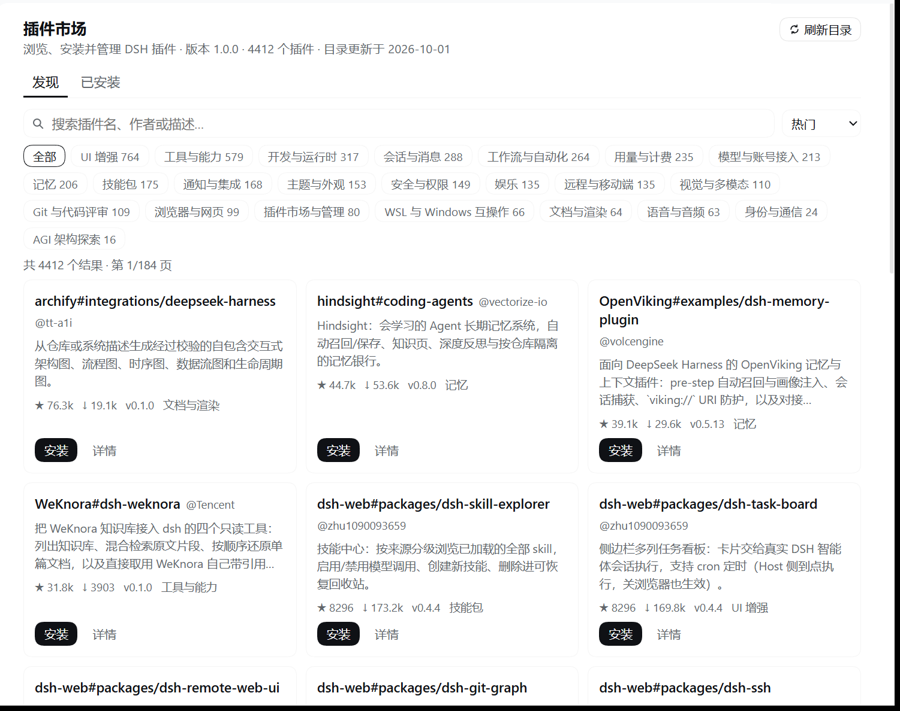

# dsh-plugin-market 设计与规范对照

本文件说明这次「重新制作一份 DeepSeek Harness 插件市场」做了什么、为什么这样做、以及每一处
如何对应官方插件规范。原始参考实现是 [dsh-market](https://github.com/dsh-market/dsh-market)，
官方规范来源是 [deepseek-ai/deepseek-harness](https://github.com/deepseek-ai/deepseek-harness)。

- 包目录：`plugin-market/`（包名 `dsh-plugin-market`）
- 接口契约：`docs/API-CONTRACT.md`
- 团队共享事实：`docs/TEAM-BRIEF.md`
- 安装脚本：`scripts/install-into-profile.ps1`
- 验收报告：`verify/REPORT.md`

## 1. 需求与定位

需求来自用户原话：

> 基于 https://github.com/dsh-market/dsh-market 上的代码，根据
> https://github.com/deepseek-ai/deepseek-harness 上插件制作规范，重新制作一份关于
> DeepSeek Harness 的插件市场；入口放置在蓝色笔记区域。

「蓝色笔记区域」经截图核对，是侧边栏**底部空白带**：它在会话/工作区列表之下、账号行
（截图里的 `epsilon-delta`）之上。对应官方 slot 就是 `sidebar.footer.action`——
其文档原文是 *Optional actions beside Settings at the sidebar foot*，渲染位置由
`packages/client/ui-sidebar/src/client/SidebarRoot.tsx` 的 `footArea` 决定：

```
<div class="footArea">
  <div class="footerActions">   ← 我们的入口注册在这里（在账号/设置行上方）
  <div class="settingsArea">    ← Settings / 账号启动器
```

所以入口落在用户圈注的位置，且用的是官方为此声明的席位，不是靠 CSS 硬挤进去的。

## 2. 交付形态：一个包，两个半

DeepSeek Harness 的插件就是 Cordis 插件，Web GUI 的插件还必须额外提供一个浏览器半。
本包的 `dsh-plugin-market` 一次提供两半：

| | 文件 | 运行位置 | 职责 |
|---|---|---|---|
| host 半 | `lib/index.js` `lib/catalog.js` `lib/http.js` | 宿主进程（Node） | 抓取并缓存社区目录、暴露 `/plugin-market` 路由、通过 `pluginManager` 服务执行安装/卸载/开关 |
| client 半 | `lib/client.js` | 浏览器（Web GUI） | 侧边栏底部入口 + 市场主面板 UI，只通过 `/plugin-market` 路由取数据 |

两侧的接口在 `docs/API-CONTRACT.md` 冻结，谁都不许单方面改。

## 3. 逐条对照官方插件规范

| 规范要求 | 本包的做法 | 依据 |
|---|---|---|
| 插件包声明 bundle 补丁层 | `package.json` 的 `dsh.bundle.patch = "./cordis.patch.yml"`，补丁用 `- insert:` 插入 `id: plugin-market` 一行 | 官方 `packages/bundle/*` 与已装插件同构 |
| 行要等依赖服务就绪 | 补丁层 `inject: [webServer]`，避免 `apply()` 早于 webServer 执行导致路由注册不上 | `docs/subsystems/web-server.md`、usage-plugin 注释 |
| host 半是 function plugin | 只 named-export `name` / `inject` / `apply`，**没有** default export | `packages/AGENTS.md`：混用会让 Loader 丢掉 function plugin 的命名空间 |
| 可选服务用 `ctx.get()` | `pluginManager` 用 `ctx.get('pluginManager')`，缺失时市场降级为只读浏览 | 同上：`ctx.<name>` 只留给声明的注入 |
| 注册即副作用，返回 disposer | 路由注册走 `ctx.webServer.register(...)`，其返回值就是卸载函数；插件卸载后路由消失 | `ctx.webServer.register` 契约 |
| 浏览器半声明 `dsh.client` | `dsh.client.platform = "web"` + `exports["./client"] = "./lib/client.js"`，宿主据此合成 `window.__DSH_BOOT__` 并在 `/plugins/??dsh-plugin-market/client.js&rev=…` 提供产物 | `docs/subsystems/client-modules.md` |
| 浏览器半的产物格式 | `window.__ModuleLoader__.load({ id: "dsh-plugin-market", factory(require) {…} })`，factory 返回 `{ inject, apply }` | 与已装 usage-plugin 完全同构，客户端模块表按包名注册 factory |
| 只使用平台种子模块 | client 半只 `require("react")`，用 `window.fetch` 取数据；不引第三方库、不写 `eval` | `packages/client/AGENTS.md`：baseline 之外的裸模块必须显式声明，本包不需要 |
| 用 `slots.inject` 注册到别人声明的席位 | `slots.inject('main', …)` 与 `slots.inject('sidebar.footer.action', …)`：等声明出现才注册，声明撤销就回滚 | `packages/client/AGENTS.md` 第 4 条 |
| 面板选择走框架动作，不自己写导航 | 入口点击调用 `ctx.get('layout').selectPanel('plugin-market')`；`main` 的 keyed 席位注册 `plugin-market` | `packages/client/ui-plugin-manager/src/client/index.ts` 是同一模式的官方先例 |
| 只消费公开 token | 颜色全部用 `--dsw-alias-*` / `--dsw-specific-*` 变量并带兜底值，不写死色值 | `docs/web-styling.md`、客户端 Theme 服务的 token 清单 |
| 文案归语言所有 | client 半 zh/en 双语字典，跟随 `ctx.locale` 的当前语言并订阅变化 | `packages/client/AGENTS.md` 的本地化规则（第三方动态包无法使用宿主字典类型，故自带字典） |
| 安装/卸载走官方 pnpm 路径 | host 半调用 `pluginManager.installBundle/removeBundle/setBundleEnabled/setPluginEnabled`，不自己起 pnpm、不改 profile 文件 | `pluginManager` 服务契约 |

**刻意不做的**：不注册 `settings.section`、不改 profile 的 `cordis.patch.yml`、不实现重启助手、
不实现 WebDAV/Gist 备份、不做主题市场、不做 giscus 评论。理由是与「在侧边栏装/管插件」这一
核心闭环无关，且都会显著扩大需要验证的面（见 §7）。

## 4. 数据来源与抓取策略

目录数据来自社区精选目录 [awesome-dsh-plugin](https://awesome-dsh-plugin.com/plugins.json)
（实测 4412 条，字段含 npm 名、GitHub 地址、双语描述、star、下载量、能力标签、分类）。
选择它而不是自己维护一份列表，是因为 dsh-market 的目录也来自同一处，两边看到的是同一份事实。

抓取在 host 半完成（浏览器直接抓会撞 CORS，且需要把重试/缓存/降级放在一处）。源的选择顺序是
**npm 镜像优先、官方源兜底**：

1. `DSHM_REGISTRY_URL` 非空 → 只用它（用户指定自己的目录时不该悄悄回退到我们的源）；
2. 否则 `https://registry.npmmirror.com` → `https://registry.npmjs.org` 上的 npm 包
   `dsh-plugin-catalog` → `https://awesome-dsh-plugin.com/plugins.json`；
3. `DSHM_NPM_MIRROR` 可以替换 npm 候选。

**为什么不是直接用官方源**：官方源挂在 GitHub Pages 上，本机直连实测 25s 超时（偶尔 35s 才通），
而 DSH 只认 `HTTP(S)_PROXY` 环境变量、不读 Windows 系统代理，宿主进程拿不到浏览器那套代理。
同一份目录发布在 npm 包 `dsh-plugin-catalog` 上，npmmirror 的元数据 97ms、1.21MB gzip 的 tarball
下载 + 解压 291ms——**289ms 对 25s 超时**。这与 dsh-market 自己的区域路由是同一套做法，不是另起炉灶。

单个源的做法：

- npm 源：`<registry>/dsh-plugin-catalog/latest`（15s 超时）→ `dist.tarball`（30s）→
  `dist.integrity` 存在时用 `node:crypto` 校验（目录是安装目标的信任锚，必须防篡改）→
  `node:zlib` 解压 + 最小 USTAR 解析取出包内 `package/plugins.json`；
- URL 源：直接 GET（30s），校验 JSON 对象 + `plugins` 数组 + 数字 `count`，拒绝 HTML；
- 每个源只试一次（源列表本身就是重试），全失败且无缓存时 502/504，文案列出依次试过的源与
  `DSHM_REGISTRY_URL` / `DSHM_NPM_MIRROR` 两条出路；有缓存则 200 + `stale: true`；
- 内存缓存 10 分钟，并发请求共用同一个 in-flight Promise，`/status` 冷启动只读缓存快照、不发网络请求。

## 5. 安全决定

- **只允许装目录里的插件**：显式 `spec` 必须在目录中存在（等于某条的 npm 名 / 仓库地址），
  否则 400 `not-in-catalog`。挡掉「让网页端随便装任意 npm 包 / git 仓库」这条攻击面。
- **POST 只收同源**：校验 `Sec-Fetch-Site` 或 `Origin` 与 `Host` 一致，否则 403。
- **请求体有上限**（64 KiB）且必须是 `application/json`。
- **不自己起包管理器**：安装/卸载交给 `pluginManager` 服务，构建脚本仍受宿主 pnpm≥10 的
  默认拦截约束，需要用户显式批准时 UI 会把 `pendingBuilds` 摆出来再重提。
- **市场不能卸载自己**：`remove dsh-plugin-market` 返回 400 并给出终端命令，避免用户点一下
  就失去唯一的 UI 入口。
- **不落盘、不带凭据**：host 半只做 GET 目录与调用宿主服务，不写任何文件；目录请求不带认证头。

## 6. 界面设计取舍

依据官方 `docs/web-styling.md` 与 `dsh-client-ui-ux` 的取向，并遵守 dsh-market 自己的
`AGENTS.md`（三条根本原则：自然、好理解、面向普通用户）：

- **一个入口，落在他圈的位置**：底部整行「插件市场」，几何对齐同目录的内建面板行
  （`min-height:36px`、`border-radius: var(--dsw-radius-md)`、hover 用
  `--dsw-alias-interactive-bg-hover`）；侧边栏收成 56px 轨道时退化为 36×36 图标按钮。
- **常态安静**：目录过期是陈述而不是警告；只有安装失败、需要批准构建脚本这两类
  「用户此刻必须做点什么」的状态才变醒目。
- **报错三件事**：每条错误都带「发生了什么 + 为什么 + 现在怎么办」，并给重试入口。
- **每个动作都有落点**：安装/卸载/开关按钮进入进行中态，结束后刷新列表并给出结果；
  任何写操作期间面板顶部有一条不确定性进度条（速度与「有没有在动」都是可读的）。
- **状态齐全**：加载中、空结果、失败、只读（宿主没有插件管理器）、深/浅色、窄屏、长描述。
- **更新是「提示 + 逐个确认」，不是一键全更**（v1.1.0）：头部「更新插件」按钮只负责告诉你
  有几个新版本（角标数字），点开就地展开可更新列表，每一条单独一个「更新到 x.y.z」。
  这是刻意的保守选择：一次只改一个依赖，失败不会连坐，也好看清是哪个包变了。
- **动效服务于状态，不服务于炫技**（v1.1.0）：进场错峰、hover 抬升、按钮按下回弹、
  页签底线滑动、提示条滑入 + 倒计时线、可更新面板就地展开。三条硬约束写在
  [API-CONTRACT §4](API-CONTRACT.md)（基础态不写 `opacity:0`、只动 transform/opacity/max-height、
  升入动画用 `backwards`），并且 `prefers-reduced-motion: reduce` 下**全部关闭而内容照旧完整可见**——
  真实浏览器里 A/B 验过，不是只看代码。

## 7. 已知限制与后续工作

- **只覆盖 Web/桌面 profile**：client 半是 `dsh.client` web 产物，headless profile 里只有
  host 半可用（可被其它消费者以 HTTP 方式调用）。
- **不做重启助手**：需要重启才生效的变更会如实显示 `application: 'restart-required'`，
  由用户自己重启（官方 dsh-market 的 detached restart helper 明确不在本次范围内）。
  自更新装完后同理：按钮回到「检查市场更新」，不会假装已经生效。
- **自更新的信任锚是 CDN 上的那份清单，不是独立签名**：路径形状 + `sha256` + 产物自证三道校验
  能挡住损坏、截断与单点替换，但挡不住「CDN 与 `index.json` 一起被换」。要有那个能力就得引入
  独立签名密钥（本次不做，已写进 [API-CONTRACT §2.9](API-CONTRACT.md) 而不是含糊过去）。
- **自更新通道依赖仓库保持 public**：转 private 后 jsDelivr 读不到文件，按钮会变成
  「更新通道没有回应」；同时别人也装不上这个插件（Release 附件要鉴权）。
- **`verify/ui-check.ps1`（真实浏览器）不在发布门禁里**：它要起宿主进程 + headless Edge，
  慢且依赖本机有浏览器。它作为「改客户端半之后手动跑一次」的步骤写进了
  [RELEASING §4.5](RELEASING.md)；门禁里跑的是它的离线部分（文案/动效不变量）。
- **不内置目录快照**：目录每天在长，旧快照会把「今天发布的插件」显示成「不存在」，
  因此宁可显示抓取失败也不回退到过期快照。
- **无收藏 / 备注 / 分组 / 备份**：这些是本地状态型功能，需要额外持久化面与一致性验证，
  本次不做；`pluginManager` 已是唯一事实来源，不做第二份缓存。
- **第三方动态包拿不到宿主字典类型**：文案字典随包发布（zh/en 两份），新增语言需要改包，
  这是动态客户端插件当前的边界。

## 8. 验收

### 8.1 独立验收（临时 profile）

`verify/REPORT.md` 是完整记录：用 `DSH_HOME=E:\AI\DeepSeek Harness\Dsh\_verify\dshhome` 建独立
profile，`dsh plugin --profile marketcheck add <本包>` 安装，起 4 个宿主实例，按契约逐条断言。
最终一轮 `verify-20261003-214407`：**47 条断言 PASS=47 / FAIL=0**，覆盖：

- 安装后 `dsh.profile.bundles` 含 `dsh-plugin-market`、`node_modules` 里有它、宿主启动日志无 FAILED fiber；
- 首页 `window.__DSH_BOOT__` 含 `id === 'dsh-plugin-market'` 的 entry，`/plugins/??dsh-plugin-market/client.js&rev=…` 返回 JS，**按 UTF-8 解码后含「插件市场」且无替换字符**；
- `/status`（冷启动 `catalog:null` 且零网络调用）、`/catalog`（真实抓取 4412 条、550ms、缓存命中与 refresh）、`/installed`（12 个 bundle，含 `market:true` 的市场自身）；
- 越权与错误路径：跨站 POST 403、GET 打 POST 405 + `Allow`、目录外 spec 400 `not-in-catalog`、卸载自身 400 `not-allowed`、未知路径 404、>64KiB 400、非 JSON Content-Type 400；
- 对抗性：客户端 bundle 无 `eval(` / `new Function(`；缺 `pluginManager` 时 `apply` 不抛且降级为只读；`updateAvailable` 在目录版本更低/更高两个方向都对。

首轮曾出现 29 pass / 10 fail，逐条定性后是 **8 条验收工具 bug + 1 条断言过期 + 1 条真实缺陷**：
真实缺陷是「目录源不可达」（官方源直连 25–93s，超出超时预算），已由 §4 的 npm 镜像优先方案修复
（实测 289–550ms）。工具缺陷（PS 5.1 读不到 4xx 正文、变量作用域遮蔽、curl 引号被剥）都写进了
REPORT 的「工具缺陷与修正」一节——验收报告承认自己的测量缺陷，比只报数字更有价值。

### 8.2 真实 profile 与真实 GUI

在用户的 `desktop` profile 上执行 `scripts/install-into-profile.ps1 -Profile desktop`：

- 装前备份 `package.json` / `cordis.patch.yml` / `pnpm-lock.yaml` 到 `_verify/backup-desktop-<时间戳>/`；
- 安装结果：`dsh-plugin-market link:E:/AI/DeepSeek Harness/Dsh/plugin-market`，pnpm 301ms，`dsh.profile.bundles` 追加 `dsh-plugin-market`，用户补丁层未改动；
- **HMR 自动生效，无需重启、无需刷新**：约 8 秒后侧边栏底部（账号行上方）出现「插件市场」入口，点击即在主栏打开市场页；
- 实测截图（真实 GUI，整窗捕获）：市场页显示 4412 条目录、23 个分类、分页 1/184，卡片带安装/详情按钮。




回滚：`pwsh -File scripts\install-into-profile.ps1 -Profile desktop -Rollback -BackupDir <备份目录>`。

### 8.3 真实浏览器渲染与动效（v1.1.0 补上）

上一轮把「真实浏览器里的 DOM 级渲染断言」列为未覆盖项，这次补上了：
`verify/ui-check.ps1` 起一个**新进程**的 scratch 宿主（所以它加载的是仓库里当前的宿主半代码，
不需要重启用户正在用的 DSH），再用系统自带的 headless Edge 通过 CDP 驱动真引擎：

- 侧边栏入口 → 点开面板 → 头部三个按钮的文案与顺序 → 角标数字（注入确定性的 `/installed`）；
- 卡片与已安装行的 `animation-name` 含 `dshpm-rise`、`animation-fill-mode` 是 `backwards`、
  存在错峰 `animation-delay`、页签底线是 `scaleX(1)`；
- 点「更新插件」展开列表：两条记录、版本走向 `v1.0.0 → v1.2.0`、每行各自的「更新到 x.y.z」、
  没有批量按钮；收起后高度归零；
- **`prefers-reduced-motion: reduce` 的 A/B**：先钉成 `no-preference` 证明动效在跑，
  再切成 `reduce` 证明 `animation-name` 变成 `none` 而列表行仍然在（内容不会消失）；
- 页面控制台无插件错误。

结论：**24/24 通过**，截图落在 `verify/logs/ui/`（`market-updates-open.png`、
`market-header-zoom.png`、`market-header-closed.png`、`market-reduced-motion.png`）。
顺带记一个踩点：headless Chromium **默认就是 `prefers-reduced-motion: reduce`**，
不显式钉 `no-preference` 的话，「动效生效」那组断言测的是一条永远关着动画的路径。

### 8.4 尚未覆盖

- 从**终端或另一个窗口**做的插件变更不会推送到已打开的市场页，需要手点「刷新目录」或重开面板。
- 官方 URL 兜底最坏 30s（只在两个 npm 源都失败时才会走到）。
- 动效只做了「计算样式层面」的断言（动画名、填充模式、延迟、reduced-motion 开关）：
  具体某一帧的观感、以及滚动中的合成性能没有自动化测量，仍靠人看截图。
- 自更新的「真要装一个**更新**」这条端到端路径，验证方式是让 scratch 宿主报告一个**旧于**
  最新标签的当前版本，再在 scratch profile 里真的下载 + 校验 + `pnpm add`（见 §8.1 的记录）；
  它没有进发布门禁，因为它需要真实网络与一次真实安装。
