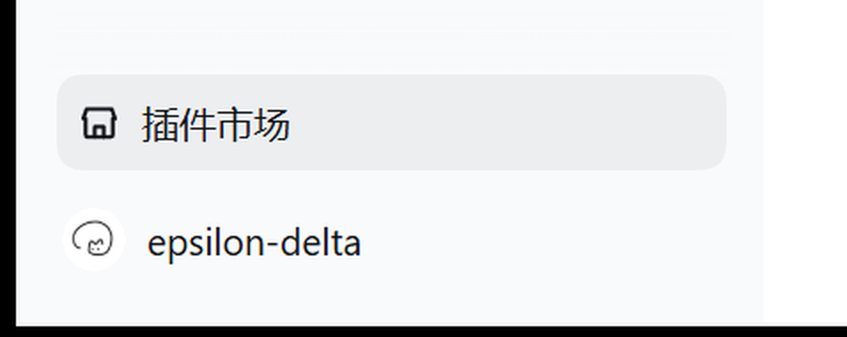
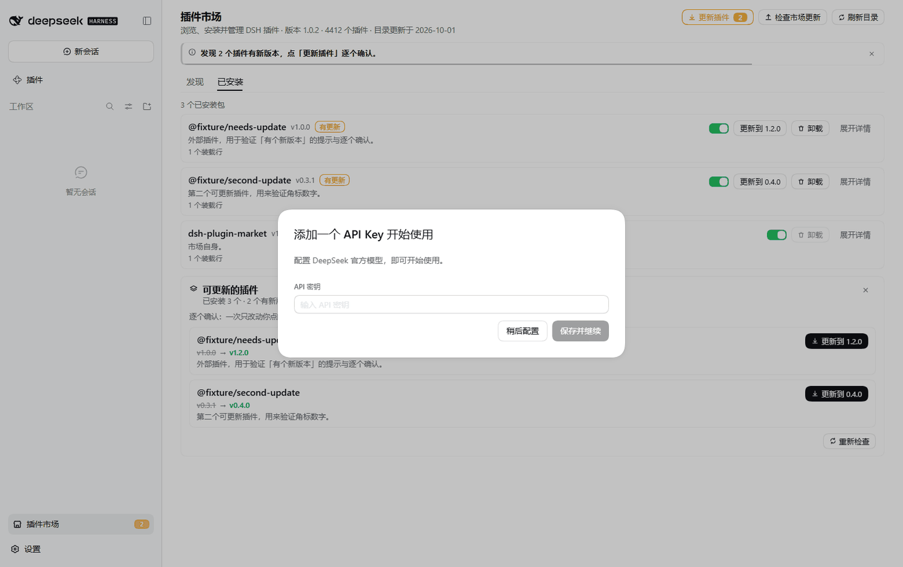
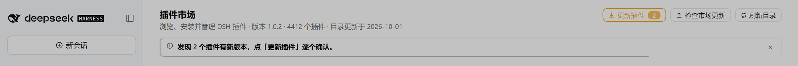

# deepseek-harness-market

[English](README.md) | 中文

**DeepSeek Harness 里的插件市场。** 侧边栏底部一个入口，点开就能浏览、搜索社区插件目录，
一键安装、更新、启用/停用、卸载，全程不用离开 GUI。

- 数据来自社区精选目录 [awesome-dsh-plugin](https://awesome-dsh-plugin.com/plugins.json)（4000+ 条，每日更新）
- 目录优先从 npm 镜像读取（`dsh-plugin-catalog` 包，本机实测 0.3 秒），官方源兜底；抓取、缓存、重试、降级都在宿主进程完成，浏览器只读 `/plugin-market`
- 安装与卸载走官方插件管理器服务（同一个 pnpm 路径、同一套构建脚本审批规则）
- 一个包同时提供 host 半与 web client 半，符合 DeepSeek Harness 插件规范

## 安装

```sh
# 本地目录（开发/自用）
dsh plugin --profile web add "E:\AI\DeepSeek Harness\Dsh\plugin-market"

# 从 GitHub Release 附件装（把版本号换成当前 Release 的；本包没有发到 npm）
dsh plugin --profile web add https://github.com/Winnie-0721/dsh-plugin-market/releases/download/v1.1.1/deepseek-harness-market-1.1.1.tgz
```

装完重启一次 `dsh web`（或让桌面端重新组合），刷新页面即可看到入口。
装好之后就不必再记这条命令了：市场头部的「检查市场更新」会自己做这件事
（按新鲜度试 GitHub Releases API 与 jsDelivr，下载后三道校验，装完提示你重启 DSH 一次）。

Windows 上一键安装并自动备份 profile：

```powershell
pwsh -File scripts\install-into-profile.ps1 -Profile desktop
# 回滚
pwsh -File scripts\install-into-profile.ps1 -Profile desktop -Rollback -BackupDir _verify\backup-desktop-<时间戳>
```

## 入口在哪

侧边栏**底部**、账号行上方的那一条（Settings 行上方）：整行显示「插件市场」，
侧边栏收成 56px 轨道时变成图标按钮。点击打开中央的市场页面。




## 你会得到什么

- **浏览与搜索**：名称/作者/描述全文搜索（300ms 防抖），分类筛选，按热门 / 最新 / 下载量 / 名称排序，分页
- **一眼看懂一张卡片**：名称、作者、star、下载量、版本、分类、双语描述；展开详情可看完整描述、能力标签、仓库与目录页链接
- **一键安装**：确认来源 → 看进度 → 结果落点明确；需要执行构建脚本时，先把要执行的包名摆出来再让你决定
- **已安装管理**：启用 / 停用（走 profile 的 patch 层，能热加载的就地生效）、卸载（含二次确认）、有更新时一键更新
- **更新提示与逐个确认**（v1.1.0）：头部「更新插件」按钮带可更新数量角标，侧边栏入口上也有一个角标；
  点开就地展开可更新列表，每条自己一个「更新到 x.y.z」。**故意不做一键全更**：一次只改一个依赖，
  失败不连坐，也好看清是哪个包变了
- **更新插件市场自己**（v1.1.0）：头部「检查市场更新」按钮 → 有新版本就变成「更新到 x.y.z」→
  下载并校验后交给宿主安装 → **重启 DSH 生效**（宿主半在进程里被缓存，按钮不会假装已经生效）
- **目录状态诚实**：显示数据源、条目数、更新时间；刷新失败时明确说「这是上一次的缓存」，不假装是最新的
- **出错给下一步**：每条错误都回答「发生了什么 / 为什么 / 现在怎么办」，并给重试入口
- **深浅色与窄屏**：颜色全部走宿主主题变量，跟随宿主语言（中文 / English）
- **克制的动效**（v1.1.0）：卡片错峰浮入、hover 抬升、按钮按下回弹、页签底线滑动、提示条滑入并带
  倒计时线、可更新面板就地展开、写操作期间顶部走一条进度条。系统开了「减少动效」时**全部关闭**，
  内容照旧完整显示（真浏览器里验过，不是只看代码）





## 配置

| 环境变量 | 作用 |
|---|---|
| `DSHM_REGISTRY_URL` | 指向你自己的目录（任何返回同结构 `plugins.json` 的地址）。设置后**只**用它，不再回退到内置源 |
| `DSHM_NPM_MIRROR` | 覆盖读取目录所用的 npm 镜像（默认依次为 `registry.npmmirror.com`、`registry.npmjs.org`） |

目录源顺序：npm 镜像上的 `dsh-plugin-catalog` → 官方 `awesome-dsh-plugin.com/plugins.json`。之所以把 npm 放在前面，是因为官方源挂在 GitHub Pages 上，在国内直连常常 25 秒超时，而 npm 镜像（含包内 `package/plugins.json`，1.2MB gzip）通常几百毫秒就能取到——本机实测 289ms 对 25s 超时。这与 dsh-market 自己的区域路由是同一套做法。

## 安全

- 只允许安装目录里存在的插件：显式传入的安装来源必须在目录中，否则拒绝
- 安装/卸载/开关只走宿主 `pluginManager` 服务，插件自己不起包管理器、不直接改 profile 文件
- 写操作只接受有可信来源证据的请求：官方桌面壳的 `dsh-app://app` origin、同源 `Origin`、或来自回环地址且没有任何来源头的请求（桌面端转发会剥掉这些头）；跨站 `Origin` / `Sec-Fetch-Site: cross-site` 一律拒绝
- 市场不能卸载自己（避免点一下失去唯一入口），会提示在终端执行官方命令
- 目录抓取只发 GET、不带任何凭据、不写磁盘
- **自更新按新鲜度试三个源**：GitHub Releases API（最权威，但匿名限流 60 次/小时）→ jsDelivr 标签列表
  → jsDelivr `@main` 的清单；三者都会滞后或被限流时，再按常规递进探 3 个候选标签兜底
  （任意标签是按需取的，所以这一层能追上刚发布的版本）。
  下载依次试 `@<tag>` → `@main` → GitHub Release 附件，三道校验：产物路径必须是 `releases/*.tgz`、
  `sha256` 必须与 `releases/index.json` 一致、解开 tarball 后包名与版本必须自证一致。
  **它挡不住「清单与产物一起被换」**——那需要独立签名密钥，目前没有。
  这条通道还要求仓库保持 public；转 private 后按钮会变成「更新通道没有回应」

## 已知限制

- 只支持 Web / 桌面 profile 的 GUI（headless profile 里只有 host 半可用）
- 需要重启才生效的变更会如实显示，不提供自动重启助手（自更新装完后同样要重启一次）
- 不内置目录快照：抓取失败时宁可报错也不显示过期目录（避免把「今天发布的插件」显示成「不存在」）
- 没有收藏 / 备注 / 分组 / 备份 / 主题市场 / 评论（见 `docs/PLUGIN-MARKET.md` §7）
- 动效只保证「计算样式层面」正确与可关闭：某一帧的观感与滚动合成性能没有自动化测量

## 开发与验收

- 接口契约：`docs/API-CONTRACT.md`
- 设计与规范对照：`docs/PLUGIN-MARKET.md`
- 验收报告：`verify/REPORT.md`，脚本入口 `scripts/verify-market.ps1`
- 真实浏览器验收（headless Edge + CDP，出截图）：`pwsh -File verify/ui-check.ps1`

```sh
# 两个半的语法检查
node --check plugin-market/lib/index.js
node --check plugin-market/lib/client.js
# 离线回归：自更新通道 / 文案与动效不变量
node verify/self-update.test.mjs
node verify/client-copy.test.mjs
```

## 许可

MIT。目录数据版权与许可归 [awesome-dsh-plugin](https://github.com/awesome-dsh-plugin/awesome-dsh-plugin) 所有。
